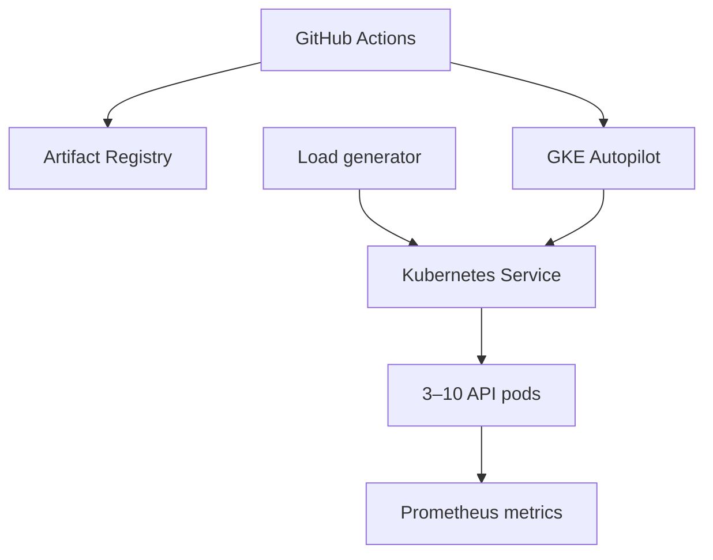

# GKE Reliability Lab

A production-style portfolio project for learning Kubernetes, Google Cloud,
and site reliability engineering. The application is intentionally tiny; the
engineering focus is safe delivery and predictable behavior during failure.

## What this demonstrates

- A non-root container with no runtime package dependencies
- Liveness, readiness, startup, and graceful-drain behavior
- Three replicas, topology spreading, zero-unavailable rollouts, and a PDB
- CPU-based horizontal pod autoscaling
- GKE Autopilot, VPC-native networking, and Artifact Registry with Terraform
- Keyless GitHub Actions authentication through Workload Identity Federation
- SLOs, an error budget, a runbook, load generation, and failure exercises



## Start here — no cloud account required

Requirements: Node.js 22 or newer.

```bash
npm test
npm start
```

In another terminal:

```bash
curl http://localhost:8080/readyz
curl http://localhost:8080/api/work
curl http://localhost:8080/metrics
npm run load
```

The tests include configuration assertions, so removing an important probe or
security control will fail CI.

## Run on local Kubernetes

Install Docker, `kind`, and `kubectl`, then run:

```bash
make kind-up
make deploy-local
kubectl port-forward -n reliability-lab service/reliability-api 8080:80
```

While `npm run load` is running, delete a pod:

```bash
kubectl delete pod -n reliability-lab -l app.kubernetes.io/name=reliability-api
```

Your first reliability result is the number of failed requests during this
disruption. Record the result before changing the system.

## Provision Google Cloud

GKE and network resources can incur charges. Use a dedicated learning project,
configure a billing budget alert, and run `terraform destroy` when finished.

Prerequisites: a Google Cloud project with billing, `gcloud`, and Terraform 1.6+.

```bash
gcloud auth application-default login
cp infra/terraform.tfvars.example infra/terraform.tfvars
# Edit the copied file with your project and GitHub repository.
terraform -chdir=infra init
terraform -chdir=infra plan
terraform -chdir=infra apply
```

Terraform prints the values needed by GitHub Actions. Add these GitHub repository
variables—none are long-lived credentials:

| Repository variable | Value |
| --- | --- |
| `GCP_PROJECT_ID` | Your Google Cloud project ID |
| `GCP_REGION` | `us-central1` or your selected region |
| `GKE_CLUSTER_NAME` | Terraform output `cluster_name` |
| `GCP_SERVICE_ACCOUNT` | Terraform output `github_service_account` |
| `GCP_WORKLOAD_IDENTITY_PROVIDER` | Terraform output `workload_identity_provider` |

The deploy workflow is manual at first. This makes each cloud change deliberate
while you learn. Add automatic promotion only after you have tested rollback.

## Repository map

| Path | Purpose |
| --- | --- |
| `src/` | Small HTTP service with health, readiness, work, and metrics endpoints |
| `test/` | Service and reliability-configuration tests |
| `k8s/base/` | Kubernetes manifests composed by Kustomize |
| `infra/` | GKE, networking, registry, and GitHub identity in Terraform |
| `.github/workflows/` | CI and manual GKE deployment |
| `docs/` | SLO, runbook, and milestone plan |
| `scripts/load.js` | Dependency-free concurrent load generator |

## Reliability exercises

1. Delete one pod during load and measure errors.
2. Change the image while load continues and observe a rolling update.
3. Set `FAILURE_RATE` to `0.05`, deploy, and verify the SLO impact.
4. Raise `LATENCY_MS`, observe p99 latency, and test an alert.
5. Roll back using `docs/RUNBOOK.md` and write a five-paragraph incident review.

Follow [the project roadmap](docs/PROJECT_PLAN.md), define success with
[the SLO](docs/SLO.md), and troubleshoot with [the runbook](docs/RUNBOOK.md).
