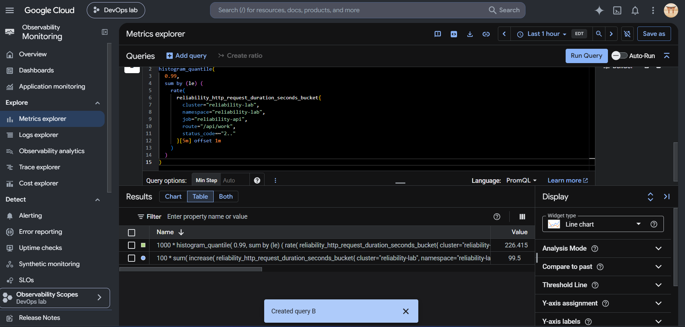
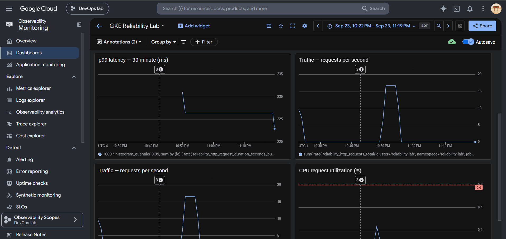
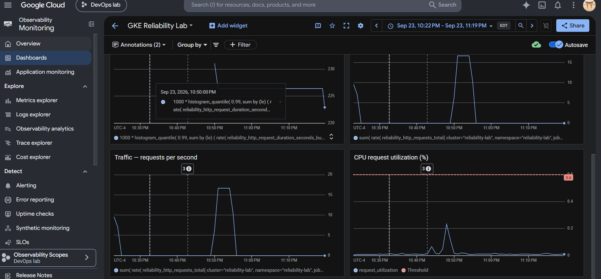

# Milestone 4 — observability results

Milestone 4 added application-level Prometheus metrics, Google Cloud Managed
Service for Prometheus collection, PromQL service-level indicators, and a
Cloud Monitoring dashboard for the reliability API.

## Test conditions

- Platform: GKE Autopilot in `us-central1`
- Workload: three baseline API replicas behind a Kubernetes Service
- Scrape target: `/metrics` every 30 seconds
- Warm-up: 500 requests at concurrency 10
- Measured run: 5,000 requests at concurrency 20
- Configured application latency: 20 ms
- Availability objective: 99.9%
- Latency objective: 99% of successful requests below 300 ms

## Measured results

| Signal | Result | Objective | Outcome |
| --- | ---: | ---: | --- |
| Successful requests | 5,000 / 5,000 | 99.9% availability | Pass |
| Network errors | 0 | 0 expected | Pass |
| Load-generator throughput | 460 requests/second | Baseline measurement | Recorded |
| Client p50 | 25 ms | Informational | Recorded |
| Client p95 | 152 ms | Informational | Recorded |
| Client p99 | 266 ms | Below 300 ms | Pass |
| Prometheus availability | 100% | At least 99.9% | Pass |
| Requests within 300 ms | 99.5% | At least 99% | Pass |
| Prometheus server-side p99 | 226.415 ms | Below 300 ms | Pass |

The traffic dashboard peaked at 16.67 requests/second because it displays a
five-minute rate: a short 5,000-request burst is averaged across 300 seconds.
The CPU-request-utilization chart stayed below the HPA's 60% target, confirming
that this request workload was not CPU-saturated.

## Measurement correction

The first histogram used buckets at 250 ms and 500 ms around a 300 ms latency
objective. `histogram_quantile()` initially estimated p99 at 320.909 ms, but
that result was too coarse to determine whether the 300 ms objective was
actually violated.

The instrumentation was improved by:

- adding an exact 300 ms histogram bucket;
- adding bounded HTTP status-code labels to the latency histogram;
- measuring the proportion of successful requests within 300 ms directly;
- retaining a p99 query for diagnostic comparison; and
- applying a PromQL offset to avoid evaluating partially ingested samples.

After the correction, 99.5% of successful requests completed within 300 ms,
and the server-side p99 estimate was 226.415 ms. This demonstrates why an SLO
threshold should align with a histogram bucket instead of relying only on
interpolation between wide buckets.

## Dashboard signals

The `GKE Reliability Lab` Cloud Monitoring dashboard contains:

1. latency SLO compliance;
2. availability;
3. p99 latency;
4. request traffic rate; and
5. CPU request utilization.

## Evidence

## Outcome

The service met both initial SLOs during the controlled load test, and the
dashboard now exposes availability, latency, traffic, and saturation signals.
Milestone 5 can use these measurements to detect deliberate latency and 5xx
faults and quantify their error-budget impact.
