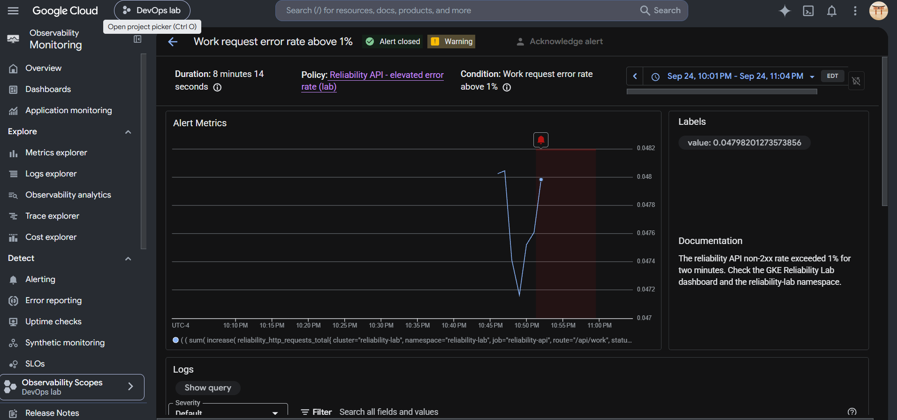
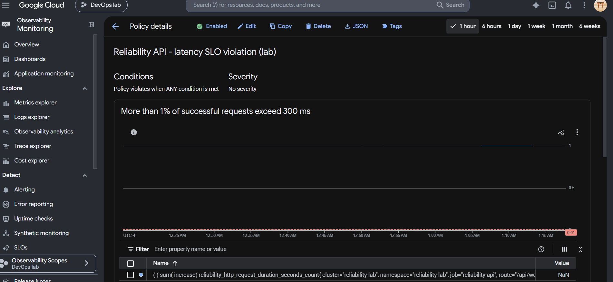

# Milestone 5 - alerting and failure-testing results

Milestone 5 validated that the reliability API can detect, notify on, recover
from, and automatically close incidents caused by controlled availability and
latency faults.

## Test conditions

- Platform: GKE Autopilot in `us-central1`
- Workload: three API replicas behind a Kubernetes Service
- Metrics: Google Cloud Managed Service for Prometheus
- Availability objective: 99.9% successful requests
- Latency objective: 99% of successful requests below 300 ms
- Lab alert window: two minutes, evaluated every minute
- Metrics ingestion offset: one minute

The short alert windows were chosen for a controlled lab. Production alerts
should use multi-window burn-rate thresholds and longer evaluation periods.

## Availability fault

The deployment was given `FAILURE_RATE=0.05`, producing intentional HTTP 500
responses while sustained traffic was sent to `/api/work`.

| Signal | Result |
| --- | ---: |
| Total requests | 20,000 |
| Successful requests | 19,049 |
| HTTP 500 responses | 951 |
| Network errors | 0 |
| Measured availability | 95.245% |
| Load-generator error rate | 4.755% |
| Alert-observed error ratio | 0.047411 (4.7411%) |
| Availability error-budget burn rate | 47.55x |

The error-rate alert opened after the non-2xx ratio remained above 1% for two
minutes and delivered an email notification. The alert measurement closely
matched the independent load-generator result.

After removing `FAILURE_RATE`, Kubernetes completed a rolling update. A
1,000-request recovery test returned 1,000 HTTP 200 responses, no network
errors, and a client p99 of 185 ms. The incident then closed automatically.

## Latency fault

The deployment was given `LATENCY_MS=500`. This kept the API available while
deliberately violating the 300 ms latency objective.

| Signal | Result |
| --- | ---: |
| Total requests | 6,000 |
| Successful requests | 6,000 |
| Failed requests | 0 |
| Network errors | 0 |
| Throughput | 19 requests/second |
| Client p50 | 503 ms |
| Client p95 | 600 ms |
| Client p99 | 650 ms |
| Alert-observed slow-request ratio | 1.0 (100%) |
| Latency error-budget burn rate | 100x |

The latency alert opened when more than 1% of successful requests exceeded
300 ms and delivered an email notification. This proved that a service can be
fully available while still severely violating its latency SLO.

After removing `LATENCY_MS`, a second 1,000-request recovery test returned
1,000 HTTP 200 responses with no network errors. Client latency returned to a
p50 of 24 ms, p95 of 104 ms, and p99 of 184 ms. The latency incident then
closed automatically.

## Incident review

- **Impact:** The availability fault reduced measured availability to 95.245%.
  The latency fault kept availability at 100% but placed every measured
  successful request above the 300 ms objective.
- **Detection:** PromQL alert policies detected both faults from application
  metrics and notified the configured email channel.
- **Root cause:** Reversible deployment environment overrides intentionally
  enabled a 5% failure rate and then a 500 ms work delay.
- **Mitigation:** Each override was removed with `kubectl set env`, triggering
  a controlled rolling update back to the declared healthy configuration.
- **Verification:** Post-recovery load tests had zero failures, latency returned
  below the objective, and both incidents automatically closed.
- **Learning:** Availability and latency need separate SLIs and alerts. A
  successful HTTP status does not guarantee an acceptable user experience.

## Evidence

## Outcome

The service completed two controlled incidents end to end: fault injection,
measurement, alerting, notification, mitigation, recovery verification, and
automatic incident closure. Both tests also quantified the impact against the
corresponding SLO error budgets.
